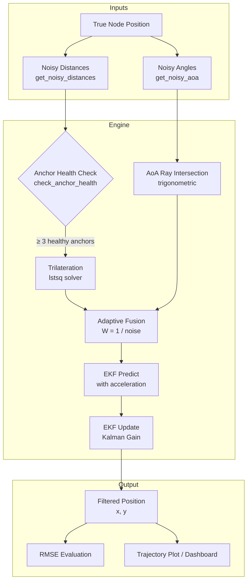
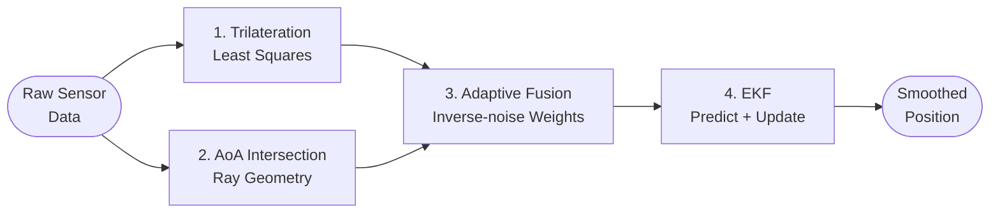

# NavHive: Hybrid Indoor Localization Simulation

> A Python simulation framework demonstrating advanced indoor positioning using sensor fusion and Kalman filtering — designed for GPS-denied environments.

---

## Overview

**NavHive** estimates the real-time position of multiple **blind nodes** (think: robots or IoT devices) moving within a bounded indoor area, using **fixed anchor stations** at known coordinates. Since GPS is unavailable indoors, the system relies entirely on two simulated wireless measurement types — **distance (RSSI/ToF)** and **angle (AoA)** — both injected with configurable Gaussian noise.

The system processes these noisy inputs through a **four-stage pipeline** per time step: Trilateration → AoA Intersection → Adaptive Sensor Fusion → Extended Kalman Filter. The result is a smooth, physics-aware trajectory estimate for each node.

---

## Architecture



---

## 🔬 Algorithm Pipeline

Each simulation step runs every node through this 4-stage pipeline:



### Stage 1 — Distance-Based Trilateration
Uses noisy distances from **≥ 3 healthy anchors** to solve an overdetermined linear system via **`numpy.linalg.lstsq`**. The matrix equation is derived by subtracting the circle equation of anchor 0 from all others:

$$\mathbf{A} \cdot \mathbf{p} = \mathbf{b}$$

Where each row of **A** is `[2(xᵢ − x₀), 2(yᵢ − y₀)]` and **b** contains the squared distance differences.

### Stage 2 — Angle of Arrival (AoA)
Computes the true bearing from anchors 0 and 1 to the node via `arctan2`, injects uniform angular noise `± NOISE_AOA°`, then solves the **ray intersection** using slope-intercept algebra:

$$x = \frac{m_1 \cdot a_{1y} - m_2 \cdot a_{2y} + a_{2x} - a_{1x}}{m_1 - m_2}, \quad y = m_1(x - a_{1x}) + a_{1y}$$

### Stage 3 — Adaptive Sensor Fusion
Blends the trilateration estimate and the AoA estimate using **inverse-noise weighting**. Lower noise → higher trust:

$$W_{dist} = \frac{1/\sigma_{dist}}{1/\sigma_{dist} + 1/\sigma_{aoa}}, \quad \hat{p}_{hybrid} = W_{dist}\cdot\hat{p}_{tri} + W_{aoa}\cdot\hat{p}_{aoa}$$

With default config (`NOISE_DISTANCE=0.4`, `NOISE_AOA=4`), trilateration carries ~91% weight.

### Stage 4 — Extended Kalman Filter (EKF)
A 4-dimensional `DynamicKalman` tracker maintains state `[x, y, vx, vy]`.

- **Predict** — uses the node's current acceleration `[ax, ay]` (from the simulated IMU) to project the next state via constant-acceleration kinematics.
- **Update** — fuses the hybrid position measurement with Kalman gain to correct the estimate and suppress noise jitter.

```
State transition:  x_k = F·x_{k-1} + B·[ax, ay]
Measurement:       z_k = H·x_k + noise     (H extracts x,y from state)
Kalman Gain:       K   = P·Hᵀ·(H·P·Hᵀ + R)⁻¹
```

---

## Anchor Health Filtering

Before trilateration, `anchor_health.py` filters out anchors with unreliable line-of-sight. Only anchors with distances below a threshold (healthy) are used. The pipeline continues **only if ≥ 3 healthy anchors remain**.

---

## Node Motion Model

All `HiveNode` instances are **static** — their positions do not change over time. The `move()` method returns a zero acceleration vector `[0, 0]`, which feeds directly into the EKF predict step (effectively a constant-position model).

```python
# HiveNode.move() — static configuration
def move(self, step):
    # Static node — position does not change
    return np.array([0.0, 0.0])
```

This models real-world scenarios such as stationary IoT sensors, fixed asset tags, or test beacons being localised against a set of known anchors.

---

## 🛠️ Project Structure

```text
navhive/
│
├── main.py                 # Standard simulation (5 nodes, Matplotlib output)
├── simulator.py            # NavHiveSimulator class — step-by-step engine
├── hive_manager.py         # NavHive class — consolidated run + evaluate
├── experiment_runner.py    # Noise sweep experiment (RMSE vs. noise curve)
├── comparison_plot.py      # Side-by-side algorithm stage comparison plot
├── generate_results.py     # Pre-generates all result figures → results/
├── dashboard.py            # Streamlit real-time interactive dashboard
├── config.py               # Global parameters
├── requirements.txt        # Python dependency list
│
├── models/
│   ├── anchor.py           # Fixed reference station
│   └── hive_node.py        # Static node with DynamicKalman tracker
│
├── engine/
│   ├── measurement.py      # Gaussian noise injection on true distances
│   ├── trilateration.py    # Least-squares circle intersection solver
│   ├── aoa.py              # Bearing calculation + ray intersection
│   ├── adaptive_fusion.py  # Inverse-noise weighted blending
│   ├── anchor_health.py    # LOS/distance threshold health check
│   ├── kalman.py           # DynamicKalman: 4-state EKF with IMU predict
│   └── fusion.py           # Static-weight fusion (baseline / legacy)
│
├── evaluation/
│   └── metrics.py          # RMSE and MAE computation utilities
│
├── tests/
│   ├── test_trilateration.py   # Unit tests for trilateration solver
│   └── test_metrics.py         # Unit tests for RMSE and MAE
│
└── results/                # Pre-generated output figures (PNG)
    ├── 01_trajectory_all_nodes.png
    ├── 02_noise_vs_rmse.png
    └── 03_comparison_stages.png
```

---

## ⚙️ Configuration (`config.py`)

| Parameter | Default | Description |
|---|---|---|
| `ANCHOR_POSITIONS` | `(0,0),(10,0),(5,8),(10,10)` | 4 fixed anchors forming a trapezoid |
| `NOISE_DISTANCE` | `0.4` | Gaussian std-dev on distance measurements (metres) |
| `NOISE_AOA` | `4` | Uniform noise on angle measurements (degrees) |
| `DT` | `1` | Timestep duration (seconds) |
| `STEPS` | `10` | Number of simulation iterations |

### Anchor Layout

```
  (5,8)
    *

(0,0)*          *(10,10)

       *(10,0)
```

---

## Entry Points — What Each Script Does

| Script | Class / Mode | Algo Pipeline | Output |
|---|---|---|---|
| `main.py` | Procedural | Trilateration → AoA → EKF | Matplotlib static plot + RMSE & MAE |
| `simulator.py` | `NavHiveSimulator` | Full pipeline with Fusion | Step-by-step positions dict |
| `hive_manager.py` | `NavHive` | Full pipeline with Fusion | Console RMSE & MAE report |
| `experiment_runner.py` | Uses `NavHiveSimulator` | Full pipeline | Noise vs. RMSE curve (Matplotlib) |
| `comparison_plot.py` | Standalone | All 3 stages side-by-side | 3-panel comparison PNG |
| `generate_results.py` | Standalone | Full pipeline | Saves all plots to `results/` |
| `dashboard.py` | Streamlit | Full pipeline | Live browser dashboard |

> **Note:** `main.py` feeds only the AoA estimate into the EKF (no fusion). `simulator.py`, `hive_manager.py`, and `experiment_runner.py` use the full Adaptive Fusion → EKF pipeline as documented above.

---

## 🚀 Installation & Usage

### Prerequisites

```bash
pip install numpy matplotlib streamlit scipy
```

### 1. Standard Simulation (Matplotlib)

```bash
python main.py
```

Runs 5 nodes for 10 steps and plots true paths vs. EKF-filtered paths for each node alongside RMSE values.

### 2. Live Interactive Dashboard

```bash
streamlit run dashboard.py
```

Launches a browser-based real-time visualization of nodes and anchor positions.

### 3. Noise vs. Error Experiment

```bash
python experiment_runner.py
```

Sweeps `NOISE_DISTANCE` across `[0.1, 0.3, 0.5, 0.7, 1.0]` over 60 steps with 5 nodes, and plots the resulting RMSE to demonstrate how sensor quality impacts localization accuracy.

### 4. Programmatic Use (NavHiveSimulator)

```python
from simulator import NavHiveSimulator

sim = NavHiveSimulator(num_nodes=3)
for step in range(50):
    positions = sim.step(step)   # returns list of {"true": ..., "filtered": ...}
```

---

## 📊 Evaluation Metrics

Two complementary metrics are computed between EKF-filtered estimates and true positions:

**Root Mean Square Error (RMSE)** — penalises large deviations more heavily:
$$\text{RMSE} = \sqrt{\frac{1}{N} \sum_{t=1}^{N} \|\hat{p}_t - p_t\|^2}$$

**Mean Absolute Error (MAE)** — treats all deviations equally:
$$\text{MAE} = \frac{1}{N} \sum_{t=1}^{N} \|\hat{p}_t - p_t\|$$

Lower values = better localization accuracy. RMSE is more sensitive to outlier measurements; MAE gives a more robust average error. The `experiment_runner.py` shows how both metrics scale with sensor noise.

---

## 👨‍💻 Author

**Swetabh Suman**  
*B.Tech Computer Science Engineering*

---

*Developed for academic research and educational demonstration in autonomous tracking and sensor fusion methodologies.*
